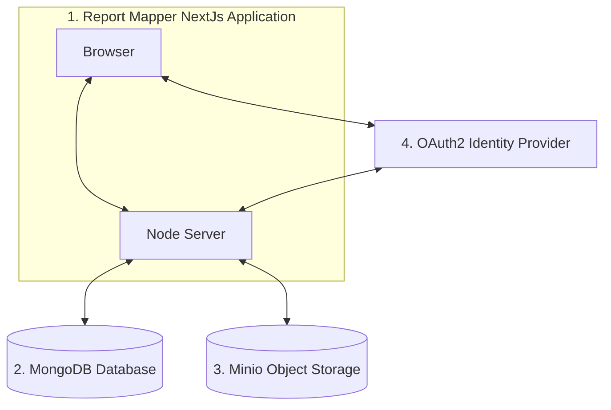

# Report Mapper

This is a Work in Progress of an application for mapping publicly submitted reports. This is a general purpose 
full stack application which prioritizes user privacy, anonymity, and transparency.

## Principals

The application development follows the following principles.

### Data Autonomy: Transparency, Privacy, and Security

A fundamental principle of this application is to protect both users and the server owners by avoiding storing any 
personally identifiable information or user content on the server which is not ultimately public. Users should be able 
to maintain anonymity by registering without any email address, phone number, or other identifying information.

### Free and Open Source

All source code is free to use as defined by the GNU General Public License. By maintaining open source, users are able
to inspect the security and privacy of the application as well as contribute to patching or reporting bugs. Part of 
staying free and open source includes avoiding integrations and dependencies on proprietary cloud providers and 
services.

## Contributing
We need help with this project. Please see the [Contributing Guide](CONTRIBUTING.md) for more information about 
contributing.

## Features

The application has the following features.

### Geolocation Mapping of Report Observations
This application will show user submitted reports on a map. Each report includes metadata such as text descriptions,
geolocation, and photos.

### Anonymous Submission of Reports
This application will allow public users to anonymously submit reports.

### Report Geolocation
The user can use the geolocation metadata from uploaded photos, current device location, or a location 
selected from a map to identify where an observation was made.

### Anonymous Reporting
Users can submit reports anonymously without providing any identifying information. This includes email addresses and 
phone numbers.

### Report Reviewing
Administrators can review reports before they are published. Administrators can also grant some users who have shown a 
consistent record or reporting accurate information access to self-publish. 

### Transparent Data Model
In general, user submitted information should be publicly available to remove the incentive for malicious parties
or organizations to attempt to gain access. This includes user submitted profile information. If a user chooses to enter 
metadata which identifies themselves, this information should be clearly publicly available to protect the 
owners of the server.

While some data such as authenticated data must be kept privately, no data should be kept private which if revealed 
could identify a user or provide additional information about a user's activity, or location.

When user submits reports, we should also make a best effort to inform them of the impact on their privacy and to 
remove unnecessary hidden data exposure such as unnecessary photo metadata.

### Authenticated Report Submission
Only authenticated users should be able to submit reports. While the users may register a username and credentials 
anonymously, all reports are tied to user accounts. This allows for accountability and transparency so that users who 
consistently provide accurate information can have quickly approved reports while safeguarding the sever from 
malicious bots, spam, vandalism, and denial-of-service attacks.

### Scalability in Both Directions
While enterprise applications often aim to be able to enhance scalability on the upper end, small volunteer-run  
projects often have the opposite problem. When a server is running on a single VPS funded by donations, being able to 
scale down is critical for sustainability. Once major cloud providers are no longer an option due to security or privacy
requirements, it is often not possible 
to use serverless strategies to scale down during times of no or low load. The single instance case matters when you 
are paying the server cost yourself.

This application is designed to deploy using a simple stack with minimal components. By combining the backend and the 
frontend into a single application, we can reduce the cost of hosting this application on small single VPS 
deployments.

At the same time, we still want to be able to scale up cost effectively when an application becomes heavily used.
By using MongoDB as a database, we support infinite horizontal scaling. By using Minio for object storage, we are able
to leverage scalable object stores across many cloud providers or we can host our own object storage service.

### Cloud Agnostic
This application is independent of proprietary cloud provider APIs.

## Required Components

In addition to this application, the following components are required.

1. Report Mapper NextJs Application
2. MongoDB Database
3. Minio Compatible Object Storage
4. OAuth2 Identity Provider

